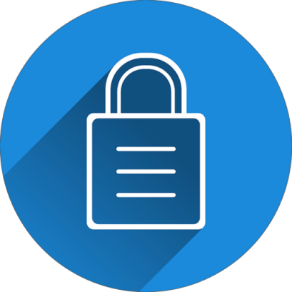
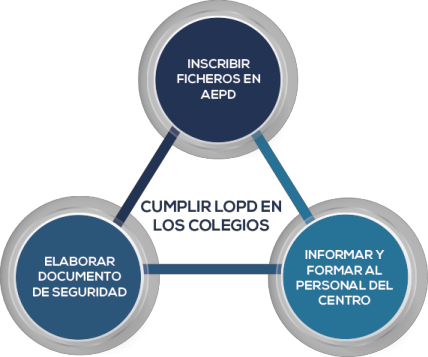

## Protección de datos
Guía básica para centros educativos

# Contenidos
- ¿ A quién va dirigida?
- ¿Por qué los centros educativos deben cumplir la LOPD?
- Requisitos para cumplir la LOPD en los centros educativos
- Obligaciones según el RGPD
- Preguntas frecuentes
- Otros recursos para centros educativos
Note: 

	
## ¿A quién va dirigida?
- Estructura organizativa del centro
- Centros educativos
- AMPA

## ¿Por qué los centros educativos deben cumplir la LOPD?
- Divulgación de fotos de actividades: Redes sociales y webs
- Aplicaciones de gestión académica: Datos personales alumnado
- Convivencia de adultos con menores
- Gran volumen de información personal estudiantes, padres, personal del centro, ...  

## Tipos de datos personales en los centros educativos
- Expediente académico
- Fichas personales profesorado y PAS
- Servicios adicionales: comedor, transporte, ...
- Proveedores
- Admisión de alumnos
- Asesoramiento psicopedagógico
- Otros ficheros: videovigilancia, controles de acceso, ...

## Requisitos para cumplir la LOPD en los centros educativos

##  Responsables de los ficheros
- Adoptar medidas de seguridad
- Inscribir los ficheros en AEPD
- Elaborar Documento de seguridad
- Informar y formar al personal del centro

## Publicación de fotografías
- Solicitar consentimiento
- Aprobar medidas seguridad
- Ojo con las subidas automáticas a la nube

## Obligaciones según el RGPD
- Llevar un *Registro de actividades de tratamiento*
- Realizar un *análisis de riesgos*.
- Realizar una *Evaluación de impacto* en Protección de Datos.
- Nombrar un *Delegado de Protección de Datos*
- Obtener los *consentimientos*
- *Notificar las violaciones de seguridad*

## Registro de actividades de tratamiento
### Información:
- Identificación del delegado de protección de datos
- Fines del tratamiento
- Descripción de las categorías de interesados y destinatarios
- Transferencias de datos a terceros
- Plazos previstos de supresión de datos
- Descripción de medidas técnicas y organizativas de seguridad
[Plantilla Derecho Rectificación](https://ayudaleyprotecciondatos.es/wp-content/uploads/2018/06/derechos-arco-rectificacion.pdf) 

## Anáslisis de riesgos
- Valorar riesgos
- Implantar medidas de seguridad
- Garantizar el número de destinatarios de la información

## Evaluación de Impacto
Obligatorio en los siguientes casos:
- Tratamiento a gran escala de *datos sensibles*
- Observación sistemática zona pública (videovigilancia)
- *Elaboración de perfiles* que produzcan efectos jurídicos

## Delegado de Protección de datos
- Obligación de nombrarlo
- Supervisa el cumplimiento de la normativa
- Sirve de enlace con la Autoridad de Protección de Datos

## Notificación de brechas de seguridad
En caso de *violación de seguridad*:
- Notificación a la Agencia Española de Protección de Datos
- Comunicar a los interesados

## Preguntas frecuentes recogida datos
- ¿Puedo recoger datos de salud de los alumnos?
- ¿Es posible recoger datos biométricos?
- ¿Es posible recoger datos sobre la situación familiar de los padres de los alumnos?
- ¿Pueden recogerse datos para fines distintos de los propios de la función educativa?
- ¿Se pueden instalar cámaras de videovigilancia en los patios de recreo y comedores?

## Preguntas frecuentes publicación datos
- ¿Se pueden publicar listas de admitidos?
- ¿Se pueden publicar beneficiarios de becas y ayudas?
- ¿Se pueden hacer públicas las calificaciones?
- ¿Pueden los padres solicitar calificaciones de hijos mayores de edad?

## Preguntas frecuentes intercambio de información
- ¿Se pueden facilitar datos de alumnos a otros centros educativos?
- ¿Se pueden comunicar datos a las Fuerzas y Cuerpos de seguridad?
- ¿Se pueden comunicar datos a los centros sanitarios?
- ¿Puede el centro solicitar información sobre asistencia sanitaria prestada?
- ¿Se pueden facilitar datos de los alumnos y sus padres al AMPA?

## Documentos para centros educativos
- [Modelo Cláusula Informativa](https://ayudaleyprotecciondatos.es/wp-content/uploads/2017/12/consentimiento-alumnos-salud-cesion-terceros.pdf) 
- [Plantilla Derecho Acceso](https://ayudaleyprotecciondatos.es/wp-content/uploads/2018/06/derechos-arco-acceso.pdf) 
- [Modelo Derecho Cancelación](https://ayudaleyprotecciondatos.es/wp-content/uploads/2018/06/derechos-arco-cancelacion-supresion.pdf) 
- [Ejemplo Documento de Seguridad](https://ayudaleyprotecciondatos.es/wp-content/uploads/2017/12/documento-seguridad.pdf) 

## Otros recursos para centros educativos
- [Guía básica protección de datos APDCAT](http://apdcat.gencat.cat/web/.content/03-documentacio/publicacions/documents/2891.pdf)
- [Guía para centros educativos AEPD](http://apdcat.gencat.cat/web/.content/03-documentacio/publicacions/documents/2891.pdf) 

# Muchas gracias
