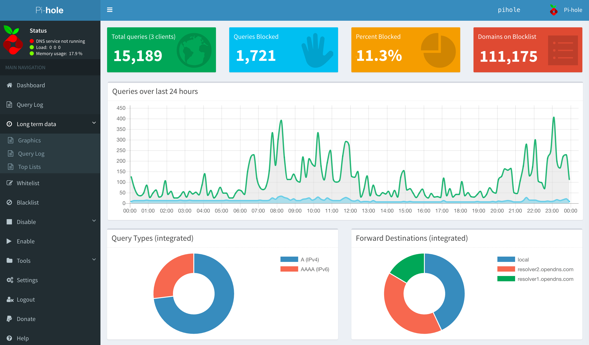

## Protección de datos
Guía básica para centros educativos

# Contenidos
- ¿ A quién va dirigida?
- ¿Por qué los centros educativos deben cumplir la LOPD?
- Requisitos para cumplir la LOPD en los centros educativos
- Obligaciones según el RGPD
- Preguntas frecuentes
- Otros recursos para centros educativos
Note: 

	
## ¿A quién va dirigida?
- Estructura organizativa del centro
- Centros educativos
- AMPA

## ¿Por qué los centros educativos deben cumplir la LOPD?
- Divulgación de fotos de actividades: Redes sociales y webs
- Aplicaciones de gestión académica: Datos personales alumnado
- Convivencia de adultos con menores
- Gran volumen de información personal estudiantes, padres, personal del centro, ...  

## Tipos de datos personales en los centros educativos
- Expediente académico
- Fichas personales profesorado y PAS
- Servicios adicionales: comedor, transporte, ...
- Proveedores
- Admisión de alumnos
- Asesoramiento psicopedagógico
- Otros ficheros: videovigilancia, controles de acceso, ...

## Requisitos para cumplir la LOPD en los centros educativos

## [Precio](https://www.kubii.es/40-raspberry-pi-3-2-b) 

## ¿Para qué sirve?
- Domótica
- Videojuegos
- Servidores caseros
- Control de redes
- ....

## Otras opciones
- [Contenedor Docker](https://hub.docker.com/r/pihole/pihole/)
- Máquina virtual
	- [Descarga](https://www.osboxes.org/raspbian/) 
	- [DIY](https://www.luisllamas.es/raspberry-pi-virtualbox/)
- Equipo antiguo
- [Alternativas a Raspberry Pi](https://tecnobits.xyz/mejores-alternativas-a-la-raspberry-pi-en-2018/) 

# [Pi-Hole](https://pi-hole.net/) 

## ¿Qué es Pi-Hole?
- dnsmasq: Un servidor ligero de DNS y DHCP.
- curl: Una herramienta de linea de comando para la gestión de peticiones HTTP.
- lighttpd: Un servidor web focalizado en el desempeño y la seguridad.
- php: Lenguaje de scripting de uso general para la web.
- AdminLTE Dashboard: Panel de control basado en Bootstrap 3.x

## Funcionamiento DNS

## DNS público

Note:
Empresa | IP Servidor DNS primario | IP Servidor DNS secundario
-- | -- | --
Google |	8.8.8.8 |	8.8.4.4
OpenDNS |	208.67.222.222|	208.67.220.220
Norton ConnectSafe|	198.153.192.40|	198.153.194.40
Comodo Secure DNS|	8.26.56.26	|156.154.70.22
OpenNIC	|202.83.95.227|	216.87.84.211
Level 3 Communications|	4.2.2.1|	4.2.2.2
Dyn Internet Guide	|216.146.35.35	|216.146.36.36
Verisign	|64.6.64.6	|64.6.65.6
Telefónica|	80.58.61.250|	80.58.61.254
Jazztel	|87.216.1.65	|87.216.1.66
Orange	|62.36.225.150|	62.37.228.20

# Instalación

## Crear máquina virtual
### Configuración básica

## Instalar Pi-Hole
	curl -sSL https://install.pi-hole.net | bash
	

## Cambiar contraseña de admin
	pihole -a -p
	
	
## Reconfiguración
	pihole -r

## Acceder al panel de administración
	http://ip/admin
 

## Configuración de los clientes

## Actualización
	pihole -up

## [VPN](https://hefistion.github.io/Pi-Hole-Bloquea-la-publicidad-desde-raspberry-pi/) 

# Muchas gracias
